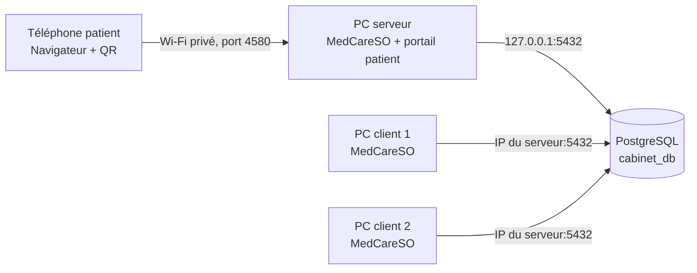

# MedCareSO 2.1.1

MedCareSO est une application Windows de gestion de cabinet médical construite avec Electron et PostgreSQL. Elle centralise les dossiers patients, les rendez-vous, la salle d’attente, les paiements, les documents médicaux, l’inventaire et plusieurs modules de spécialité.

Le logiciel fonctionne en monoposte ou en réseau local. Dans une installation multi-postes, une seule base PostgreSQL est hébergée sur le PC serveur du cabinet et tous les postes clients utilisent cette même base.

> Ce dépôt contient le code source. Il ne doit contenir aucun mot de passe réel, aucune sauvegarde patient et aucune clé privée de production.

## Fonctionnalités principales

- Gestion des patients et de leur historique médical.
- Rendez-vous, calendrier et rappels.
- Salle d’attente avec ordre de passage et suivi des statuts.
- Portail patient local accessible par lien ou QR code.
- Arrivée avec rendez-vous ou sans rendez-vous depuis un téléphone.
- Consultations, examens cliniques, prescriptions et documents PDF.
- Paiements, dettes, dépenses et statistiques.
- Inventaire, fournisseurs, lots FEFO, commandes et point de vente.
- Équipements médicaux et maintenance.
- Comptes administrateur, médecin et assistant avec permissions.
- Licence partagée au niveau du cabinet et de sa base PostgreSQL.
- Sauvegarde locale et options de synchronisation configurables.

## Spécialités disponibles

L’application charge les modules activés pour le cabinet et la spécialité du praticien :

- Médecine générale.
- Médecine physique et réadaptation (MPR).
- Rééducation et suivi des séances.
- Cardiologie.
- Dentisterie.
- Imagerie médicale partagée.

Les fonctionnalités communes restent disponibles indépendamment de la spécialité : patients, calendrier, paiements, documents, inventaire, salle d’attente et paramètres.

## Architecture de déploiement



### PC serveur

- Héberge PostgreSQL et la base `cabinet_db`.
- Exécute MedCareSO.
- Héberge le portail patient local lorsque celui-ci est activé.
- Doit avoir une adresse IPv4 réservée dans le routeur.

### PC client

- Exécute MedCareSO, sans base locale séparée.
- Se connecte à l’adresse IPv4 du serveur sur le port PostgreSQL.
- Utilise la même version de MedCareSO que le serveur.

### Téléphone patient

- Ne nécessite aucune application.
- Doit être connecté au Wi-Fi privé du cabinet pour un portail local.
- Accède à une URL de la forme `http://IP_SERVEUR:4580/rdv/TOKEN`.

## Prérequis de production

- Windows 10 ou Windows 11 64 bits.
- Droits administrateur pendant l’installation.
- PostgreSQL installé sur le PC serveur ; le déploiement actuel est validé avec PostgreSQL 18.
- Réseau local privé stable et PC serveur avec IPv4 réservée.
- Port TCP 5432 autorisé uniquement pour le sous-réseau du cabinet.
- Portail patient : accès à l’application serveur sur le port configuré, 4580 par défaut.
- Stratégie de sauvegarde quotidienne et support de restauration testé.

## Installation dans un cabinet

La base PostgreSQL est préparée avant l’installation de MedCareSO.

1. Installer PostgreSQL sur le PC serveur.
2. Exécuter `SETUP_WINDOWS/SCRIPT_POSTGRESQL_COMPLET.sql` avec un administrateur PostgreSQL.
3. Configurer `postgresql.conf`, `pg_hba.conf` et le pare-feu pour le réseau privé.
4. Lancer l’installeur et choisir **PC serveur / principal**.
5. Tester la connexion avec `127.0.0.1`, le port `5432`, la base `cabinet_db` et le compte applicatif du cabinet.
6. Démarrer MedCareSO, laisser les migrations s’appliquer et configurer le cabinet.
7. Installer la même version sur chaque poste client en utilisant l’IPv4 réservée du serveur.
8. Activer la licence au niveau de la base du cabinet.
9. Configurer les comptes, périphériques, sauvegardes et le portail patient.
10. Exécuter la recette finale avant la mise en service.

Le déroulement détaillé, les commandes, les contrôles et le dépannage sont disponibles dans [le guide d’installation complet](docs/SOURCE_GUIDE_INSTALLATION_PROFESSIONNEL.md).

## Installation PostgreSQL

Depuis un terminal disposant de `psql` :

```powershell
psql -U postgres -f "SETUP_WINDOWS\SCRIPT_POSTGRESQL_COMPLET.sql"
```

Le script demande le mot de passe du rôle applicatif sans imposer de secret de production dans le dépôt. Il crée ou met à jour :

- le rôle `cabinet_app` ;
- la base `cabinet_db` ;
- les droits sur le schéma public ;
- les privilèges nécessaires aux migrations MedCareSO.

Exemple de règle `pg_hba.conf` à adapter au véritable sous-réseau :

```text
host    cabinet_db    cabinet_app    192.168.1.0/24    scram-sha-256
```

Ne pas utiliser une règle ouverte sur Internet et ne pas donner au compte `cabinet_app` l’accès à la base système `postgres`.

## Portail patient et QR code

Dans MedCareSO :

1. Ouvrir **Paramètres > RDV**.
2. Activer le portail local.
3. Conserver ou modifier le port, 4580 par défaut.
4. Laisser l’URL publique vide pour un usage uniquement sur le réseau local.
5. Enregistrer puis tester le QR code depuis un téléphone connecté au même Wi-Fi.

Le PC serveur et MedCareSO doivent rester actifs pour que le portail local soit disponible.

## Licence

- La licence appartient au cabinet et à sa base PostgreSQL, pas à un poste individuel.
- Une seule licence est active à la fois dans la base.
- Tous les postes connectés à cette base reconnaissent la même licence.
- Une licence illimitée ne possède ni date d’expiration ni liaison à un appareil.
- La migration `005_seed_system_licenses.sql` crée et répare les clés système attendues par l’application.

Les clés et secrets de production ne doivent jamais être publiés dans le README, les captures d’écran ou les journaux.

## Développement

### Dépendances

- Node.js 18 ou version compatible avec Electron 28.
- npm.
- PostgreSQL pour les tests d’intégration.
- Inno Setup 6 pour produire l’installeur final Windows.

### Démarrage

```powershell
npm install
npm start
```

Le script de démarrage reconstruit d’abord le preload Electron. Si Electron se comporte comme un processus Node, vérifier que la variable `ELECTRON_RUN_AS_NODE` n’est pas définie.

### Tests

```powershell
npm test
npm run test:transactions
npm run test:migrations
```

Les tests PostgreSQL nécessitent une base dédiée dont le nom contient `test`. Ne jamais exécuter les tests de migration sur la base de production.

### Construction de l’installeur Inno Setup

```powershell
npm run build:inno
```

Le résultat est généré dans `dist/inno`. Pour une distribution en cabinet, l’exécutable doit être signé numériquement afin de réduire les blocages Smart App Control et SmartScreen.

## Organisation du dépôt

```text
src/main/                         Processus principal Electron, base et IPC
src/main/database/migrations/     Migrations PostgreSQL versionnées
src/main/handlers/                Opérations métier
src/preload/                      API sécurisée exposée au renderer
src/renderer/                     Interface utilisateur
src/renderer/specialties/         Modules chargés par spécialité
src/shared/                       Contrats IPC partagés
SETUP_WINDOWS/                    Préparation PostgreSQL et migration client
scripts/                          Tests, génération et outils de build
docs/                             Documentation technique et opérationnelle
installer-inno.iss                Installeur Windows Inno Setup
```

## Documentation

- [Source du guide professionnel d’installation](docs/SOURCE_GUIDE_INSTALLATION_PROFESSIONNEL.md)
- [Prompt prêt à utiliser avec ChatGPT](docs/PROMPT_CHATGPT_GUIDE_INSTALLATION.md)
- [Migrations PostgreSQL](docs/POSTGRESQL_MIGRATIONS.md)
- [Audit de migration PostgreSQL](docs/POSTGRES_MIGRATION_AUDIT.md)
- [Protocole de migration d’un client existant](SETUP_WINDOWS/PROTOCOLE_MIGRATION_CLIENT_EXISTANT_POSTGRESQL.txt)

## Sécurité et exploitation

- Utiliser un compte nominatif par utilisateur.
- Changer les mots de passe temporaires à la première connexion.
- Conserver les secrets en dehors du dépôt Git.
- Limiter PostgreSQL au réseau privé du cabinet.
- Ne jamais exposer directement le port 5432 sur Internet.
- Sauvegarder la base quotidiennement et tester régulièrement une restauration.
- Mettre à jour tous les postes avec la même version de MedCareSO.
- Journaliser les interventions techniques et les changements de configuration.

## Version

Version documentée : **MedCareSO 2.1.1**.

Ce projet manipule des données médicales sensibles. Toute mise en production doit respecter les obligations de sécurité, de confidentialité et de conservation applicables au cabinet concerné.
